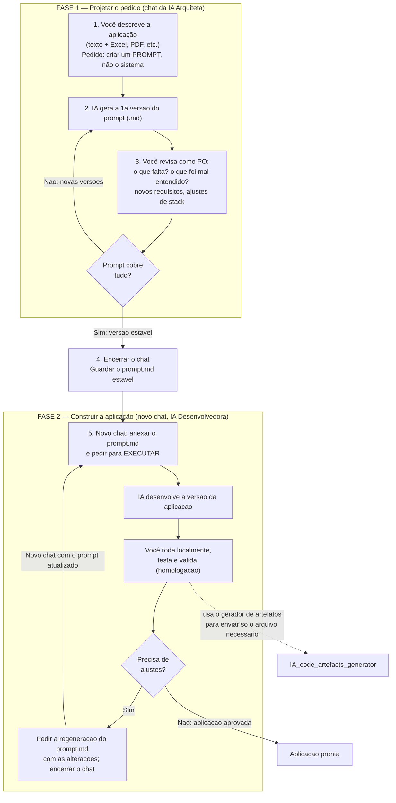

# DOP — Desenvolvimento Orientado a Prompt

Um método passo a passo para transformar uma ideia em uma aplicação funcional usando IA, mesmo que você não seja uma pessoa técnica. O **DOP (Desenvolvimento Orientado a Prompt)** organiza o trabalho em duas grandes fases — **projetar o pedido** e **construir a aplicação** — e trata a IA ora como um líder técnico que ouve suas necessidades, ora como o desenvolvedor que executa.

---

## A ideia central

Construir software com IA dá muito mais certo quando separamos duas coisas que costumam ser misturadas:

1. **Decidir o que será feito** (os requisitos, as regras, o objetivo).
2. **Escrever o código** que faz aquilo.

No DOP, cada uma dessas etapas acontece em um **chat separado** e com um **papel diferente** para a IA. Primeiro você conversa com uma "IA arquiteta" para produzir um documento de especificação — que chamamos de **prompt**. Depois, num chat novo, uma "IA desenvolvedora" recebe esse prompt e constrói a aplicação.

O elo entre as fases é sempre um **arquivo `.md` (Markdown)**: o prompt é gerado, revisado e guardado nesse formato, e é ele que você leva de uma fase para a outra. No DOP, o prompt é a **fonte da verdade** do projeto — não o código.

---

## Papéis envolvidos

- **Você (PO — Product Owner):** é o dono do produto. Conhece o problema a ser resolvido e decide se os requisitos estão corretos e completos. Não precisa saber programar; precisa saber **o que** a aplicação deve fazer.
- **IA Arquiteta (Fase 1):** atua como líder técnico(a) que ouve você, propõe a stack (as tecnologias) e escreve a especificação.
- **IA Desenvolvedora (Fase 2):** recebe a especificação pronta e escreve o código da aplicação.

---

## Visão geral do fluxo

---

# FASE 1 — Projetar o pedido (o prompt)

Nesta fase você **ainda não pede para desenvolver nada**. O objetivo é produzir um documento de especificação claro e completo — o **prompt** — que depois será entregue a outra instância da IA para construir a aplicação.

## Passo 1 — Descreva a aplicação que você precisa

Abra um chat e explique, com o máximo de detalhes possível, **qual aplicação você precisa** e **qual problema ela resolve**. Fale como se estivesse explicando para um(a) profissional que vai liderar o projeto tecnicamente.

Sempre que possível, **anexe materiais de apoio** que ajudem a IA a entender o contexto: planilhas de Excel, PDFs, documentos, exemplos de telas, regras de negócio — qualquer arquivo que possa ser transformado em descrição qualitativa. Quanto mais rico o material, melhor a especificação.

O pedido essencial desta etapa é: **"crie um prompt para o Claude desenvolver esta aplicação"**. Ou seja, você está pedindo para a IA **escrever a especificação**, e não para ela já sair programando.

## Passo 2 — Receba a primeira versão do prompt

A IA vai gerar a **primeira versão do prompt**, em formato `.md`. Esse documento normalmente descreve o objetivo da aplicação, as funcionalidades, as regras de negócio e uma proposta técnica (a stack e a infraestrutura sugeridas).

Trate essa primeira versão como um **rascunho para discussão**, não como algo pronto.

## Passo 3 — Revise como Product Owner (a "reunião de requisitos")

Aqui está o momento mais importante da fase. Você, no papel de PO, deve **analisar criticamente** o prompt gerado, como se estivesse em uma reunião de levantamento de requisitos onde a IA é o(a) desenvolvedor(a) ouvindo você. Verifique especialmente:

- **Cobertura:** todos os requisitos que você precisa estão contemplados?
- **Entendimento:** a IA entendeu corretamente cada regra? Há algo interpretado de forma errada?
- **Faltas:** existe alguma funcionalidade, regra ou detalhe que ficou de fora?
- **Ajustes de stack:** a IA deve **sugerir** as tecnologias, a infraestrutura e as decisões técnicas. Se você tiver conhecimento técnico suficiente, pode **solicitar mudanças** na stack; se não tiver, pode confiar na sugestão dela ou pedir que explique os prós e contras.

Devolva à IA suas críticas e complementos de forma direta: o que falta, o que corrigir, o que acrescentar.

## Passo 4 — Itere até a versão estável

Repita os passos 2 e 3 quantas vezes forem necessárias. A cada rodada, a IA gera uma **nova versão do prompt** (sempre em `.md`), incorporando suas correções. O ciclo termina quando você, como PO, considerar que **tudo o que a aplicação precisa já está coberto** — essa é a **versão estável** do prompt.

Ao chegar nesse ponto:

- **Encerre o chat** da Fase 1.
- **Guarde a versão estável** do prompt (`.md`) e quaisquer artefatos auxiliares que a IA tenha gerado junto. Esse conjunto é o que abre a Fase 2.

> **Por que encerrar o chat?** Um chat longo acumula todo o histórico de discussão, o que ocupa espaço e mistura rascunhos com a versão final. Começar a Fase 2 "do zero", apenas com o prompt estável, mantém tudo limpo e focado.

---

# FASE 2 — Construir a aplicação

Agora sim entramos no desenvolvimento. A partir do prompt estável, a IA vai construir a aplicação, e você vai testá-la e refiná-la.

## Passo 5 — Execute o prompt em um novo chat

Abra um **chat novo** (a "IA Desenvolvedora"). A **única** coisa que você faz aqui é **anexar o prompt estável** (`.md`) e os artefatos auxiliares, e pedir para a IA **executar o prompt** — ou seja, desenvolver a aplicação descrita.

A IA então produz a **primeira versão da aplicação**. A partir daí, começa a fase de desenvolvimento e homologação:

- **Rode a aplicação localmente** na sua máquina.
- **Teste** as funcionalidades e **valide** se o comportamento corresponde ao que foi especificado.

Esse ciclo de testar e validar pode ser **longo**, e isso é normal — é onde a aplicação ganha maturidade.

## Passo 6 — Refine em ciclos e regenere o prompt a cada versão

Sempre que os testes revelarem ajustes necessários (correções de bugs ou novas funcionalidades), o procedimento é:

1. **No mesmo chat**, peça à IA que **regenere o prompt** (`.md`), incorporando as alterações que devem ser feitas. Assim, o prompt permanece sempre como a "fonte da verdade" atualizada da aplicação.
2. **Encerre o chat.**
3. Abra uma **nova instância** (chat novo), anexe o prompt atualizado e recomece o ciclo do Passo 5.

Repetir esse ciclo — desenvolver, testar, regenerar o prompt, recomeçar limpo — é o que mantém o projeto organizado e evita que a conversa acumule ruído ao longo do tempo.

### Otimização: enviar apenas o arquivo necessário

Durante a Fase 2, para corrigir bugs e implementar funcionalidades sem sobrecarregar a conversa, use o **gerador de artefatos para IA**:

**https://github.com/vitorguimaraes/IA_code_artefacts_generator**

Essa ferramenta prepara o código do projeto em arquivos `.txt` (contornando a limitação de anexar certas extensões) e ajuda a identificar quais arquivos importam para cada mudança. Além disso, o próprio prompt deve **instruir a IA a solicitar, sob demanda, o arquivo específico** que a alteração pedida afeta — em vez de receber o projeto inteiro. Isso torna o desenvolvimento muito mais enxuto e eficiente, enviando à IA apenas o que é realmente necessário para cada tarefa.

---

## Por que o DOP cria um novo chat a cada ciclo

A troca de chat entre uma fase/versão e outra não é um detalhe — é uma escolha deliberada do método, por **dois motivos** que se somam:

### 1. Limitação da ferramenta (contexto que não persiste)

O DOP foi desenhado tendo o **Microsoft Copilot** como ferramenta de trabalho, e a experiência de chat padrão do Copilot **não possui, hoje, um recurso de "Projeto"** como o do Claude. No Claude, um **Project** é um espaço de trabalho persistente: você sobe documentos para uma base de conhecimento, define instruções fixas e todas as conversas daquele projeto herdam esse contexto automaticamente, sem precisar reenviar nada a cada nova conversa.

No Copilot, esse conceito de espaço persistente por projeto não está disponível na interface de chat comum — não há pastas nem base de conhecimento por projeto, algo que a própria comunidade de usuários vem pedindo à Microsoft. Como não dá para "guardar" o contexto num projeto e voltar a ele, o DOP faz o caminho inverso e igualmente eficaz: mantém a **fonte da verdade fora da ferramenta**, no arquivo `prompt.md` (e nos artefatos auxiliares). Assim, "abrir um novo chat e anexar o prompt" cumpre o mesmo papel que um Project cumpriria — só que de forma manual e portável.

> **Nuance:** dentro da família Microsoft 365 Copilot existe um recurso chamado **Copilot Notebooks**, que agrupa arquivos, chats e páginas como um espaço persistente por tema — o mais próximo de um "projeto". Ainda assim, a experiência de chat comum do Copilot (a que o DOP assume) não oferece esse workspace persistente, o que mantém a rotação de chats como a abordagem padrão do método.

### 2. Higiene de contexto (vale para qualquer ferramenta)

Mesmo em ferramentas que **têm** o conceito de projeto, começar limpo a cada versão traz ganhos por si só. Um chat longo acumula todo o histórico de rascunhos, tentativas e discussões — isso consome espaço da janela de contexto e mistura decisões antigas com as atuais. Ao recomeçar apenas com o `prompt.md` estável, a IA recebe **somente o que importa agora**, o que tende a melhorar o foco e a qualidade das respostas.

Ou seja: a rotação de chats **compensa** a ausência do recurso de projeto no Copilot **e**, ao mesmo tempo, é uma boa prática de contexto que o DOP adotaria de qualquer forma.

---

## Como o DOP se relaciona com Spec-Driven e Prompt-Driven Development

O DOP não nasce no vácuo: ele é uma implementação prática de um movimento maior que a indústria vem consolidando em 2025–2026. Vale conhecer os termos "oficiais" para situar o método e aproveitar o que já foi produzido pela comunidade.

### Spec-Driven Development (SDD)

O **Spec-Driven Development** parte do princípio de que a *especificação*, e não o código, é a fonte da verdade: você escreve um "spec" antes de programar, e a IA gera e valida o código a partir dele. O fluxo canônico é `Ideia → Especificação → Plano → Tarefas → Código`, e o insight central é o mesmo do DOP — a IA trabalha muito melhor a partir de uma especificação estruturada do que de um pedido solto. ([The GitHub Blog](https://github.blog/ai-and-ml/generative-ai/spec-driven-development-with-ai-get-started-with-a-new-open-source-toolkit/), [Medium — mapa de 30+ frameworks](https://medium.com/@visrow/spec-driven-development-is-eating-software-engineering-a-map-of-30-agentic-coding-frameworks-6ac0b5e2b484))

Ferramentas conhecidas dessa corrente incluem o **Spec Kit** (GitHub) e o **Kiro** (AWS), ambas organizando o trabalho em fases de especificação, design e tarefas, com o PO "dirigindo" e o agente escrevendo o código. ([The GitHub Blog](https://github.blog/ai-and-ml/generative-ai/spec-driven-development-with-ai-get-started-with-a-new-open-source-toolkit/), [Kiro Docs](https://kiro.dev/docs/))

A Thoughtworks (Martin Fowler) descreve **três níveis de maturidade** do SDD: *spec-first* (escreve-se o spec antes), *spec-anchored* (o spec é mantido para evoluir a funcionalidade) e *spec-as-source* (o spec é a fonte principal ao longo do tempo, e é ele que a pessoa edita — não o código). O DOP se posiciona no nível mais avançado, **spec-as-source**, justamente porque o prompt é regenerado a cada ciclo e permanece como a fonte viva do projeto. ([martinfowler.com](https://martinfowler.com/articles/exploring-gen-ai/sdd-3-tools.html))

### Prompt-Driven Development (PDD)

A vertente de **Prompt-Driven Development** enfatiza que o *arquivo de prompt* é o código-fonte, e que o software deve ser **regenerado a partir da intenção** em vez de acumular correções manuais no código. Essa é exatamente a lógica do Passo 6 do DOP: a cada mudança, regeneramos o prompt, não remendamos o código. ([promptdriven.ai](https://promptdriven.ai/))

Há também respaldo acadêmico para tratar o prompt como artefato de software de primeira classe, na proposta de **"Promptware Engineering"**, que adapta princípios de Engenharia de Software ao ciclo de vida do prompt (requisitos, design, implementação, teste, evolução). ([arXiv 2503.02400](https://arxiv.org/abs/2503.02400))

### O que o DOP acrescenta

Situado nesse cenário, o DOP é um SDD do tipo *spec-as-source* combinado com a disciplina de *prompt-as-source* do PDD, com três ênfases próprias que os frameworks maiores não destacam:

- **Dois agentes, dois chats, dois papéis.** A separação explícita entre IA Arquiteta (Fase 1) e IA Desenvolvedora (Fase 2), em conversas distintas, deixa o método simples de seguir mesmo para quem não é técnico.
- **Higiene de contexto por rotação de chat.** Encerrar o chat e recomeçar limpo a cada versão é uma disciplina deliberada para manter o contexto enxuto — e, como visto acima, também compensa a ausência de um recurso de "Projeto" no Copilot.
- **Alimentação de arquivo sob demanda.** Com o `IA_code_artefacts_generator` e a instrução, no próprio prompt, para a IA pedir apenas o arquivo específico de cada mudança, o desenvolvimento fica muito mais econômico e focado.

Em resumo: o DOP é uma forma acessível e disciplinada de fazer Spec-Driven Development na variação *prompt-as-source*, desenhada para colocar o PO no comando e manter o processo leve do início ao fim.

---

## Boas práticas que sustentam o DOP

- **Um chat por objetivo.** Fase 1 em um chat; cada rodada da Fase 2 em um chat novo. Isso mantém o contexto limpo e focado.
- **O prompt `.md` é a fonte da verdade.** Toda decisão da aplicação vive nele. Ao regenerá-lo a cada versão, você sempre tem um documento fiel ao estado atual.
- **Guarde as versões do prompt.** Manter o histórico dos `.md` permite voltar atrás e entender a evolução do projeto.
- **Você decide, a IA propõe.** Nas questões técnicas, a IA sugere; você aprova ou pede alternativas. O controle do produto é sempre seu.
- **Envie só o necessário.** Na Fase 2, o gerador de artefatos e o envio sob demanda evitam sobrecarregar a IA com arquivos irrelevantes.

---

## Resumo em uma tabela

| Fase | Chat | Papel da IA | Você faz | Entregável |
|---|---|---|---|---|
| 1. Projetar o pedido | Um único chat | Arquiteta / líder técnico(a) | Descreve a aplicação, anexa materiais, critica e refina | Prompt estável (`.md`) |
| 2. Construir a aplicação | Um chat novo por ciclo | Desenvolvedora | Anexa o prompt, executa, testa, valida e pede ajustes | Aplicação funcional + prompt atualizado (`.md`) |

---

## Glossário rápido

- **DOP (Desenvolvimento Orientado a Prompt):** o método descrito neste documento — projetar o prompt e depois construir a aplicação a partir dele, em ciclos.
- **PO (Product Owner):** a pessoa dona do produto, responsável por definir e validar os requisitos. É o seu papel no DOP.
- **Prompt:** o documento de especificação (em `.md`) que descreve tudo o que a aplicação deve ser e fazer; é a fonte da verdade do projeto.
- **Projeto (feature de IA):** espaço de trabalho persistente (como o do Claude) que guarda instruções e uma base de conhecimento reutilizada em todas as conversas. O chat comum do Copilot não oferece esse recurso, o que motiva a rotação de chats do DOP.
- **Stack:** o conjunto de tecnologias usado para construir a aplicação (linguagens, frameworks, banco de dados, infraestrutura).
- **Homologação:** a etapa de testar e validar a aplicação para confirmar que ela atende ao que foi especificado.
- **Markdown (`.md`):** um formato de texto simples e legível, usado aqui para escrever e transportar os prompts entre as fases.
- **SDD / PDD:** Spec-Driven Development e Prompt-Driven Development, as correntes que fundamentam o DOP.
